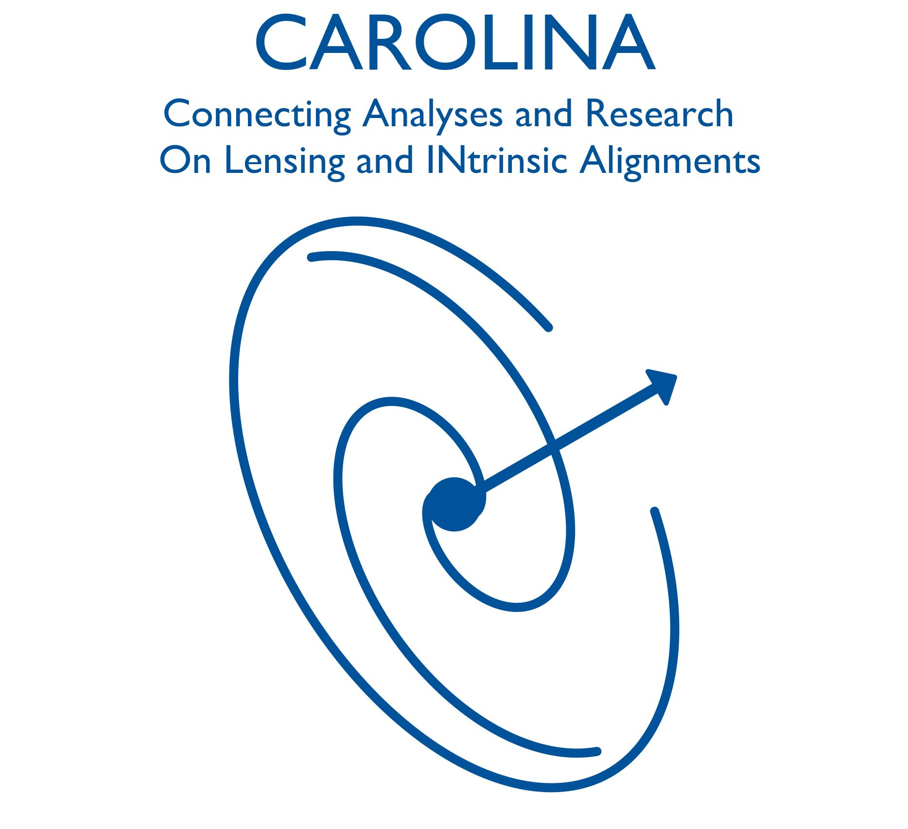

  

**CAROLINA: echo-IA Workshop**
**September 15–19, 2025 · Duke University (Durham, NC) + Online**

---

## Overview
The CAROLINA: echo-IA Workshop brings together researchers working on intrinsic alignments (IA),
weak lensing, and related systematics.
The format is highly interactive and self-organized, with a mix of talks,
working sessions, and collaborative activities.

---

## Location & Format
- **In-person:** Duke University, Durham, North Carolina  
- **Virtual:** Remote participation will be supported via Zoom (link shared with registered participants in Slack).  

---

## Quick Links
- [Website](https://echo-ia.github.io/CAROLINA/)  
- [Schedule](https://echo-ia.github.io/CAROLINA/pages/schedule.html)  
- [Logistics](https://echo-ia.github.io/CAROLINA/pages/logistics.html)  
- [Participants](https://echo-ia.github.io/CAROLINA/participants/)  
- [Registration](https://echo-ia.github.io/CAROLINA/pages/registration.html)  

---

## Contact
For questions, please reach out to the organizers via Slack or email:  
- **Niko Šarčević** · nikolina.sarcevic@duke.edu  

---

<i>We look forward to seeing you in Durham and online!</i>

