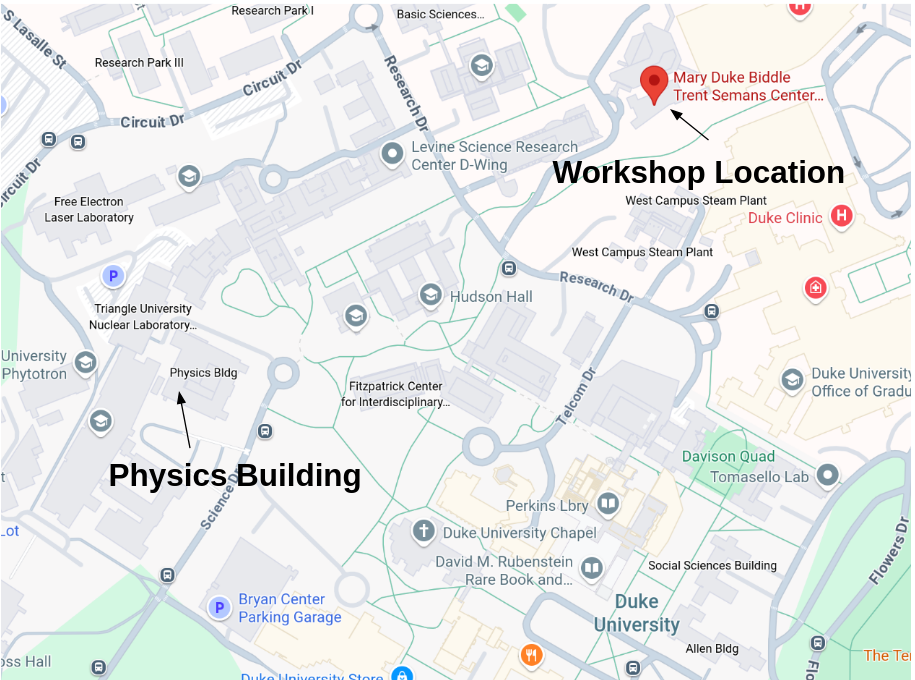

[Connection](#connection)  
[Wi-Fi](#wi-fi)  
[Location](#location)  
[Travel](#travel)  
[Weather](#weather)  
[Accommodation](#accommodation)  
[Social Activities](#social-activities)  
[Funding](#funding)  
[Accessibility](#accessibility)  
[Insurance](#insurance)  
[Emergency Contacts](#emergency-contacts)  

---

# Connection
Most workshop communication will take place in our dedicated Slack space.
Participants will be added to Slack by the organizers.
Remote participation will also be possible via Zoom, with connection details shared in Slack
closer to the start of the workshop.

If you would like to join the echo-IA GitHub organization,
which will host repositories related to the workshop, please provide your GitHub username [here](https://forms.gle/i44GjtfSNJ7YUWjK6).

All scheduled talks will be streamed, but not every work session will have a virtual option,
and some may be online only. Since the workshop is intended to be highly interactive and self-organized, 
the availability of in-person or online participation will depend on the organizers of individual sessions
and the level of interest.

---
# Wi-Fi

Duke University offers free Wi-Fi through **[DukeVisitor](https://oit.duke.edu/service/dukevisitor-network/)**
and **[Eduroam](https://oit.duke.edu/service/eduroam/)**.  
- **[Eduroam](https://oit.duke.edu/service/eduroam/)**: Available for participants from institutions that support Eduroam — log in with your home institution credentials.  
- **[DukeVisitor](https://oit.duke.edu/service/dukevisitor-network/)**: Free guest access available on campus; follow the prompts to connect when selecting the network.

---
# Location 

The CAROLINA Workshop will be held at the Mary Duke Biddle Trent Semans Center for Health Education,
located at [8 Searle Center Dr, Durham, NC 27710](https://www.google.com/maps?client=firefox-b-1-d&sca_esv=c48dc88e8766c10f&output=search&q=mary+duke+biddle+trent+semans+center+for+health+education&source=lnms&fbs=AIIjpHxU7SXXniUZfeShr2fp4giZ1Y6MJ25_tmWITc7uy4KIehZSPZtq-ywdxHK81a_1UWmZHKJ6oqjHuUktiabrRPeHJMsvLtH8GNAdGHXBY55oOcQgKj85Zt8V0rJBqqM2jRLVOpwhMemqaFe_3JlhfsrbwzIEzn71Fr66wXjX2eFkeBIwcD5fliuxdO7E3jZZwFrqx1YiZL2nX8zmQMDFMNA9nTTfsA&entry=mc&ved=1t:200715&ictx=111). 

The main workshop sessions will take place in this building on **the fourth floor**.
Primarily, TSCHE 4067 Classroom #4 and TSCHE 4030 Conference Room #4A. Signs inside will direct you to conference
registration. 

Alternative work spaces: the Physics Building is located at 120 Science Dr, a short walk from the Center for Health Education. In addition, the Perkins and Bostock Libraries are nearby and unlocked during the day. We additionally encourage virtual participants to liberally connect over Slack workspace and virtual breakout rooms.

  

---
# Travel

The nearest airport is [Raleigh-Durham (RDU)](https://www.rdu.com/maps-and-directions/). 

In addition to Uber / Lyft, some hotels also provide shuttle services to Duke,
so be sure to check if your booked hotel offers this option. 
There are also public transport options around the Research Triangle.
The GoTriangle bus system (for transportation between Durham, Chapel Hill, and Raleigh) currently
charges [fare](https://gotriangle.org/fares-passes). 
However, within Durham, the GoDurham bus system and the Duke University bus system are **free**. 

---
# Weather

In mid-September, central North Carolina typically experiences warm and humid conditions,
with average daytime temperatures ranging from [75–85°F (24–30°C)](https://www.usclimatedata.com/climate/durham/north-carolina/united-states/usnc0192).
We recommend bringing a reusable water bottle and light clothing to stay comfortable outdoors.
Indoor venues in the U.S. are often air-conditioned, so packing an extra layer is advisable.

---
# Accommodation

Here are some recommended hotels in the area:

- [JB Duke Hotel](https://jbdukehotel.reservationstays.com/hotels/PlO11pnG?utm_source=adwords_semro&utm_campaign=G%3ARS%3AUS%3APMAX%3ADSA-Chains%3AUS%3AEN&gad_campaignid=21191562182&expand_params=false&redirect_auth_retry=true), 230 Science Dr, Durham, NC 27708. This hotel is on campus, walking distance, and upscale.
- [The Lodge](https://www.lodgeatdumc.com/?gad_campaignid=12236737849), 2306 Elba St, Durham, NC 27705. This hotel is also walking distance, but budget-friendly.
- [Hilton Garden Inn](https://www.guestreservations.com/Hilton-Garden-Inn-Durham-University-Medical-Center/booking?utm_source=google&utm_medium=cpc&utm_campaign=973003610&gad_campaignid=973003610), 2102 West Main St, Durham, North Carolina, 27705. This hotel is near Ninth Street with good access to food and coffee. It is also on the H5 bus line to the workshop location. 
- [AC Marriott](https://www.guestreservations.com/ac-hotel-by-marriott-durham/booking?utm_source=google&utm_medium=cpc&utm_campaign=1014862718&gad_campaignid=1014862718&ctTriggered=true), 2800 Erwin Rd, Durham, NC 27705. This is another walking distance hotel on the edge of campus which is more upscale. 
- [Residence Inn](https://www.guestreservations.com/residence-inn-durham-mcphersonduke-university-medical-cntr/booking?utm_source=google&utm_medium=cpc&utm_campaign=834685359&gad_campaignid=834685359), 1108 West Main St, Durham, NC, 27701. This hotel is more affordable and on the 11 and 11b bus lines to campus. The location downtown near East Campus is around a lot of food and coffee options.
- Airbnb is also an option: **Duke** is able to reimburse Airbnb, as long as the receipt includes your name, dates, and full cost. Be sure to save your confirmation email and final receipt for reimbursement.

**Note:** During hotel checkout, be sure to **ask for an itemized receipt** (with your name, dates, and total amount). This is often **required for reimbursement**, especially by university or DOE policies. Even if you booked online, some funders (like DESC or Duke) may request this specific checkout receipt as proof of stay.

---

# Social Activities

In addition to the workshop sessions, we encourage participants to explore Durham together.
A few highlights within walking or short driving distance include:
- [Sarah P. Duke Gardens](https://gardens.duke.edu) – a large public botanic garden on campus.
- [Duke Lemur Center](https://lemur.duke.edu) – home to the world’s most diverse population of lemurs outside Madagascar.
- [American Tobacco Campus](https://americantobacco.co) – revitalized historic tobacco warehouses with restaurants and outdoor spaces.
- [Nasher Museum of Art](https://nasher.duke.edu) – contemporary and classical art exhibitions on Duke’s campus.
- [Museum of Life and Science](https://www.lifeandscience.org) – interactive exhibits and outdoor areas suitable for all ages.
- [9th Street](https://www.discover9thstreet.com) – a lively area with restaurants, cafés, and shops.
- [Raleigh](https://www.visitraleigh.com) is also nearby, offering additional museums, historic buildings, and government landmarks for those who may wish to self-organize day trips. 

We will have at least one group dinner organized during the week.
For other activities, participants are encouraged to coordinate informally—whether that means
visiting local attractions, grabbing a meal, or exploring the city together after workshop hours.

---
# Funding

Funding is available and the participants who asked for funding have been contacted. If you have any questions or concerns regarding funding, please contact Niko or Susan. 

* **Niko**:  nikolina.sarcevic@duke.edu
* **Susan**: susan.tierney@duke.edu

---
# Accessibility

The workshop venue is wheelchair accessible.
If you have additional accessibility needs (e.g., mobility, vision, hearing, or other accommodations),
please let the organizers know in advance so we can provide support.

---
# Insurance

Participants are expected to arrange their own travel and medical insurance through their home institutions.
The organizers cannot assume responsibility for individual coverage or expenses related to travel disruptions,
illness, or medical care during the workshop.

---

# Emergency Contacts

* **On-site contact**: Nikolina Šarčević (nikolina.sarcevic@duke.edu)
* **Duke University Campus Police**: +19196842444 (non-emergency)
* **Emergency**: 911
* **Medical**: Duke Urgent Care or Duke University Hospital Emergency Room
